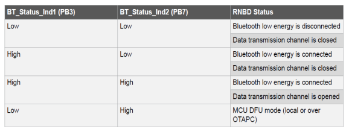
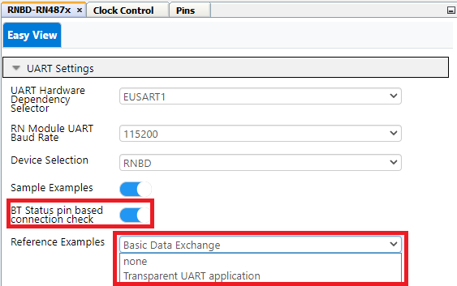
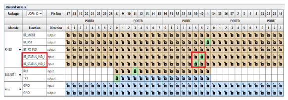
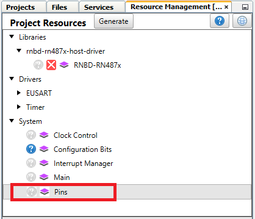
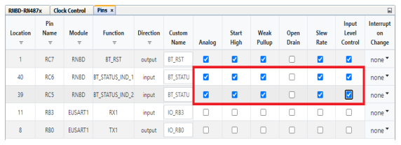
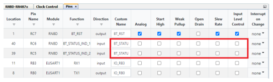

# RNBD GPIO Based Connection Setup

The RNBD451 device has BT Status indication 1 and BT Status indication 2 pins which can be used  to indicate GPIO based connection status. This feature can be useful in the scenario  were the host MCU can verify the BT connection status by monitoring the status  indication pins other than monitoring the connect message in the serial UART prints.

**Ble Status Indication Pin Table:**

 

 

**PIN Mapping Between RNBD BLE Status 1 & 2 Pins with PIC18F47Q10:**

 

|Pin Functionality|RNBD Pin Number|PIC18F47Q10 Pin Number|
|-----------------|---------------|----------------------|
|Ble Status Indication 1|PB3|PC6|
|Ble Status Indication 2|PB7|PC5|

 

 

1.  Selecting GPIO Based Connection for Both Basic Data Exchange & Transparent UART Application

     

    

     

2.  Pin Selection for Status Indication 1 & 2 Pins under Pin Grid View:

     

    

     

3.  Pins Setting under Project Resource:

     

    

     

    By Default Analog, Start High, Weak Pullup, Slew Rate, Input Level Control  checks will be selected for Status Indication Pin 1 & 2

     

    

     

    **Uncheck** the Analog, Start High, Weak Pullup, Slew Rate, Input Level  Control checks as shown in the below Picture

     

    

     

 

**Parent topic:**[RNBD451 Set Up & Running Example Application](GUID-67A04F29-B099-418B-A3E7-B4781BE8AF34.md)

