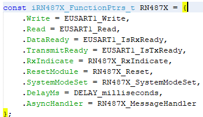
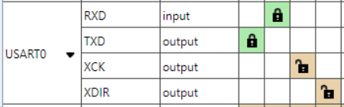
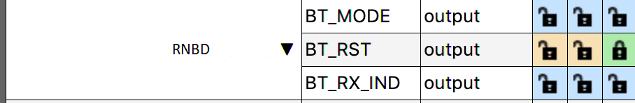

# Summary

**Command, Data Communication with Asynchronized Message Processing:**

This driver contains, at its' core, the inherent code capability of distinguishing  between **Message** exchange and **Data** exchange between the connected MCU and  Module devices.

The library supplies all required Application Programming Interfaces \(APIs\) required to  create functional

implementation of operation a BLE connected end-device.

Through the MCC configuration the physical connection of the \(3\) required pins can be  selected through the GUI.

These are the \(2\) UART pins used for communication, and control of the **RST\_N**  connected to the RNBD Module.

Additionally; this Library allows for extension of Module pin behaviors through the  simple RNBD Module object

interface; where any device/project specific instantiations exist.  **rnbd\_interface.c/h**/**rn487x\_interface.c/h**

A brief description of the Interface, and object extension is described below:

iRNBD\_FunctionPtrs\_t is a typedef struct which can be found in  **rnbd\_interface.h**/**rn487x\_interface.h** and consist of \(9\) function  pointers. In the **rnbd\_interface.c**/**rn487x\_interface.c**, the concrete  creation of RNBD as an object is instantiated. Within  **rnbd\_interface.c**/**rn487x\_interface.c** are the **private static**  implementations of desired behavior. In some cases, such as DELAY or UART, the  supporting behavior is supplied through another supporting library module. When  applicable ‘inline’ has been used to reduce stack depth overhead.

 

 

 

 

The driver library itself should not require any modifications or injections by the user;  unless to expand upon the supported command implementations **rnbd.c/h**

**Configurable Module Hardware Requirement\(s\):**

A single UART instance used for communication between MCU and Module:

 

 

The Library allows for configuration of \(3\) Pins associated with support features  extended through the Driver Interface. Only \(1\) Pin is required by the RNBD Modules for  operation; this is the modules **RESET** pin.

 

 

 

|Library Name: Output\(s\)|Module: Input\(s\)|Description|Module Physical Defaults|
|-------------------------|------------------|-----------|------------------------|
|BT\_MODE|P2\_0|  1 : Application Mode  0 : Test Mode/Flash Update/EEPROM Cofiguration |Active-Low, Internal Pull-High|
|BT\_RST|RST\_N|Module Reset|Active-Low, Internal Pull-High|
|BT\_RX\_IND|P3\_3|Configured as UART RX Indication pin|Active-Low|

 

