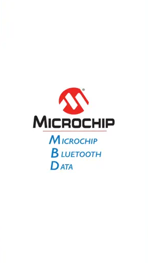

# RNBD Example1: Running Basic Data Exchange Example Application

**Basic Data Exchange:**

|This example shows how an MCU can be programmed to transmit data  to a smart phone over BLE. Here the MCU device will send Periodic  Transmission of a single character when **STREAM\_OPEN** is  processed through the Message Handler. This indicates to the MCU  & RNBD Module that the application is in a DATA STREAMING mode  of operation; and can expect to hear data over the BLE  connection.\#define DEMO\_PERIODIC\_TRANSMIT\_COUNT  \(10000\)\#define DEMO\_PERIODIC\_CHARACTER \(‘1’\)Are  used in the example can be found \#defined at the top of  rnbd\_example.c.|

1.  Download and Install Phone Application for demonstration:
    1.  **Microchip Bluetooth Data**by **Microchip** from the [App Store](https://apps.apple.com/us/app/microchip-bluetooth-data/id1319166097) or from [Google Play Store](https://play.google.com/store/apps/details?id=com.microchip.bluetooth.data&hl=en_IN&gl=US).
2.  Launch the Phone Application

    

     

    

     

    Click on the 'BLE Smart' Sub Apps as shown below:

    

3.  The Application will automatically scan the area for Bluetooth devices within a range. Look for "RNBD" device under scanned list.

     

    

     

4.  On selecting the "RNBD" device from the list will be ready to connect with RNBD Module once you click on CONNECT Button

     

    

     

5.  Once connected Microchip Bluetooth App discovers all the services and characteristics supported by the RNBD451 device as shown in the following figure.

    

6.  Click on Microchip Data Service Option and Select the Microchip Data Characteristic and Write Notify Indication to receive the data in Mobile App.

    

7.  Select "Listen for notifications" on the application.
    -   It may be required to "enable notification" access to the app on the  phone.

        Data will begin to Send at a Periodic Rate to the device.

        Data will become visible beneath the Notify/Listen Toggle Option.

        -   Before Enabling the Notify/Indicate Toggle Button:

            

            After Enabling the  Notify/Indicate Toggle Button Mobile App can read the data  31\(Hex Value\) which was sent from RNBD Module.

            

This is the END of the Basic Data Exchange Example

**Parent topic:**[RNBD451 Set Up & Running Example Application](GUID-67A04F29-B099-418B-A3E7-B4781BE8AF34.md)

