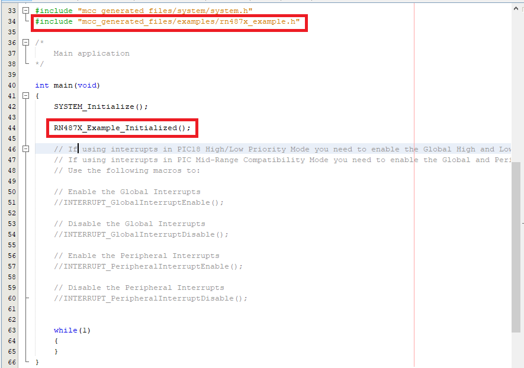

# RN487x Code Generation & Compilation

 

1.  Click the **Generate** button which will be next to Project Resource

     

    

     

2.  Include the header \#include "mcc\_generated\_files/examples/rn487x\_example.h" in **main.c**
3.  Call the function **Example\_Initialized\(\);** in **main\(\)** after **SYSTEM\_Initialize\(\)**

     

    

     

4.  Pin Mapping Table between MCU & RN4871 Click

     

    |S.no|PIN Functionality|PIC|RN487x Click|
    |----|-----------------|---|------------|
    |1|Receive \(RxD\)|RB3|Tx|
    |2|Transmit \(TxD\)|RB0|Rx|
    |3|BT\_RST|RC7|RST|

     

5.  Connect the development board of your choice and connect the RN487x to the proper slot\(\) as shown below.

    **Note:** Connect RN4871 Click to **Slot 2** as shown in below image

     

    

     

    **Important:** Slot was decided based on the UART Instances which was configured for this example application \(**PIN Mapping between MCU & RN4871 Click**\).

6.  Build the Generated Project:

    

7.  Program to the Board:

    

 

**Parent topic:**[RN487x Set Up and Running Example](GUID-F2370094-12C3-4CC6-B1DF-5465EBC4FC33.md)

