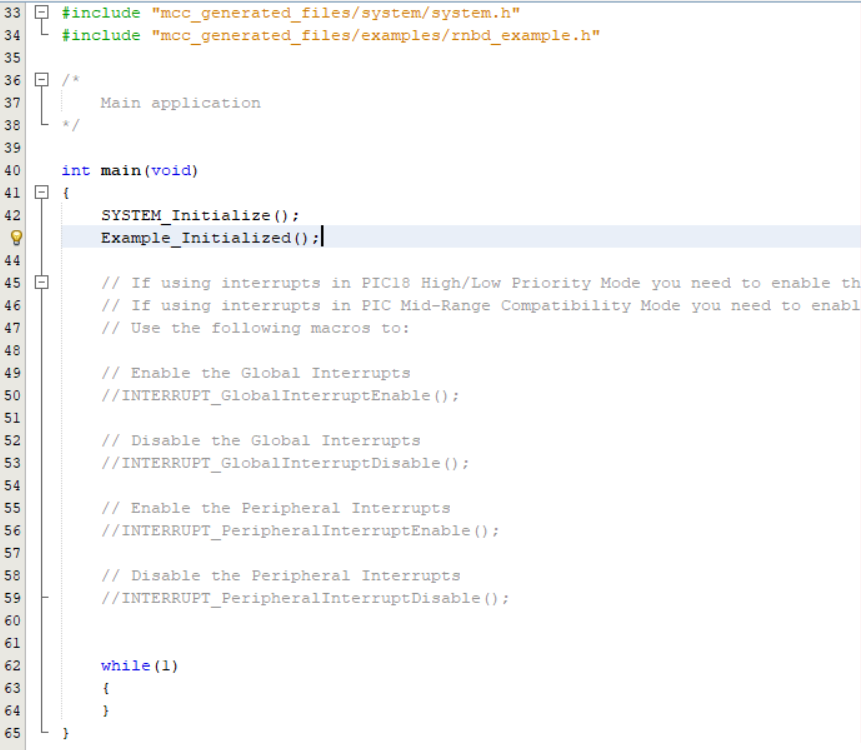
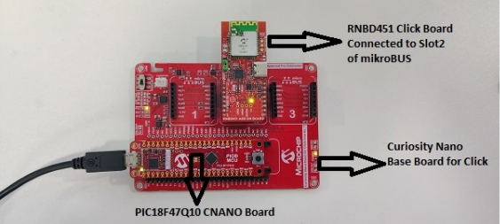

# RNBD Code Generation & Compilation

 

1.  Click the **Generate** button which will be next to Project Resource

     

    

     

2.  Include the header \#include "mcc\_generated\_files/examples/rnbd\_example.h" in **main.c**
3.  Call the function **Example\_Initialized\(\);** in **main\(\)** after **SYSTEM\_Initialize\(\)**.
4.  Pin Mapping Table between MCU & RNBD Click

     

    |S.no|PIN Functionality|PIC|RNBD Click|
    |----|-----------------|---|----------|
    |1|Receive \(RxD\)|RB3|Tx|
    |2|Transmit \(TxD\)|RB0|Rx|
    |3|BT\_RST|RC7|RST|

     

5.  Connect the development board of your choice and connect the RNBD to the proper slot\(\) as shown below.

    **Note:** Connect RNBD Click to **Slot 2** as shown in below image

     

    

     

    **Important:** Slot was decided based on the UART Instances which was configured for this example application \(**PIN Mapping between MCU & RNBD Click**\).

6.  Build the Generated Project:

    

7.  Program to the Board:

    

 

**Parent topic:**[RNBD451 Set Up & Running Example Application](GUID-67A04F29-B099-418B-A3E7-B4781BE8AF34.md)

