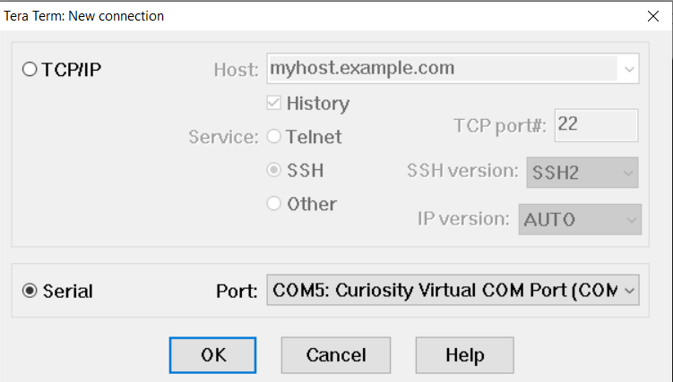
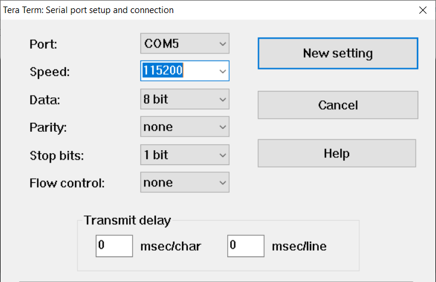

# RNBD Example2: Running Transparent UART Example Application

 

 

 

|Transparent Serial:|
|-------------------|
|  This example will demostrat data transmitted from a PC serial  terminal is written to a smart phone app and vice versa. The MCU  device will act as a bridge, and pass data between RNBD Module �  MCU → Serial Terminal.  This action will occur when STREAM\_OPEN is processed  through the Message Handler. For this example, data typed into  the Serial Terminal will appear on the BLE Phone Application,  and Data sent from the Application will appear on the Serial  Terminal. |

 

1.  Download and Install Phone Application for demonstration:
    -   **Microchip Bluetooth Data** by **Microchip** from the [App Store](https://apps.apple.com/us/app/microchip-bluetooth-data/id1319166097) or from [Google Play](https://play.google.com/store/apps/details?id=com.microchip.bluetooth.data&hl=en_IN&gl=US).
2.  Launch the Phone Application

    

    

     

    

     

    After Installing open the MBD App and Click on **BLE UART** Sub Apps:

     

    

     

3.  On Selecting PIC32CXBZ scan for available devices to connect. The Application will automatically scan the area for Bluetooth devices within a range. By default, the device should appear as "RNBD451\_xxxx"

     

    

     

4.  For Transparent Serial only: Open a "Serial Terminal" Program such as Tera Term, Realterm, PuTTY, Serial; or similar. Baud Rate will be configured as: 115200

     

    

     

     

    

     

5.  Once Connected with RNBD451\_0EC4 click on Text Mode at bottom of the settings as shown below to initiate the data transfer.

     

    

     

    - Check Serial Terminal for the status of the connection.

     

    

     

6.  Enter the text to be transferred from mobile to RNB45x device and click send button

     

    

     

    - The data will be received at the RNBD45x side and will be displayed in  serial terminal of RNBD45x

     

    

     

7.  Type any data on the serial terminal of the RNBD45x to send to the Microchip Bluetooth Data App, which is received and printed on the receive view of the Microchip Bluetooth App.

     

    

     

     

    

     

This is the END of the Transparent UART Example

**Parent topic:**[RNBD451 Set Up & Running Example Application](GUID-67A04F29-B099-418B-A3E7-B4781BE8AF34.md)

