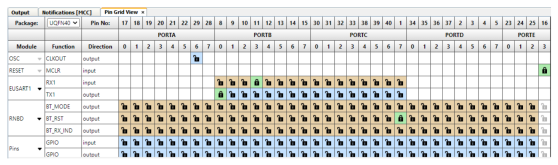

# RN487x Basic Data Exchange PIN Settings

 

-   **PIC18F47Q10 MCC Configuration - Basic Data Exchange Example**

    

     

    

     

 

**Note:**

-   Basic Data Exchange Application uses only one instance of EUSART1 for data transfer
-   **Important:** EUSART Rx1/Tx1 **Uncheck** Analog, Slew Rate & Input Level Control checkboxes as shown below.

    

     

    

Configuration for PIC Basic Data Exchange was completed click [here](GUID-46C11149-1505-4DF7-86F9-FAB478F1DEF6.md) for code  generation steps.

**Parent topic:**[RN487x Set Up and Running Example](GUID-F2370094-12C3-4CC6-B1DF-5465EBC4FC33.md)

