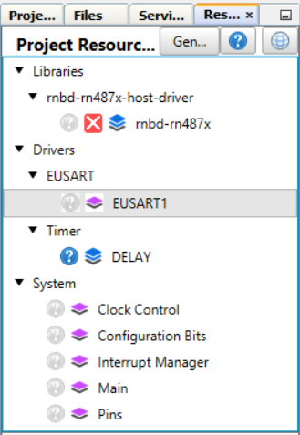
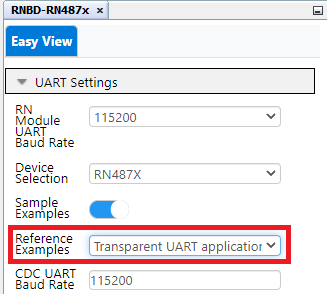
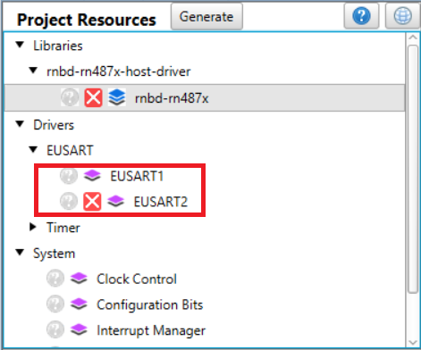
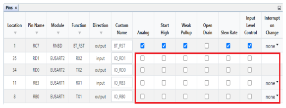
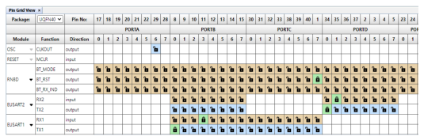

# RN487x Transparent UART Application PIN Settings

 

-   PIC18F47Q10 MCC Configuration - Transparent Serial Example

    

     

    

     

 

Since PIC18F47Q10 has only **Two Instance** of EUSART's the second EUSART was loaded  Automatically for CDC UART \(If Device has more Number of Instances will be listed  accordingly to select the respective EUSART's\)

**Note:**

-   Transparent UART Application uses two instance EUSART1 & EUSART2 for data transfer
-   Make sure **Interrupt Driven** was enabled for both **EUSART1** & **EUSART2**.
-   **Important:** EUSART Rx1/Tx1 & Rx2/Tx2 **Uncheck** Analog, Slew Rate & Input Level Control checkboxes as shown below.

     

    

     

    

Configuration for PIC Transparent UART was completed click [here](GUID-46C11149-1505-4DF7-86F9-FAB478F1DEF6.md) for code  generation steps.

**Parent topic:**[RN487x Set Up and Running Example](GUID-F2370094-12C3-4CC6-B1DF-5465EBC4FC33.md)

