# Project Setup

 

1.  [Create a New Project](https://www.youtube.com/watch?v=iZuucxaAVLg) in [MPLAB® X IDE](https://www.microchip.com/mplab/mplab-x-ide).

    

2.  The Process described below is reflective of the Validation Hardware used with Microchip Bluetooth Data Mpbile App. Microcontrollers used for reference are the PIC18F47Q10 8-bit devices.
3.  Open MCC by clicking Tools → Embedded → MPLAB® Code Configurator OR click on the MCC icon. 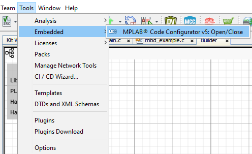

    or

    

4.  If MCC is not available; it is required to be installed. Navigate to Tools→ Plugins. Under Available Plugins select MPLAB® Code Configurator, ensure the checkbox is selected and press Install. Once this installation is completed, MCC will be available.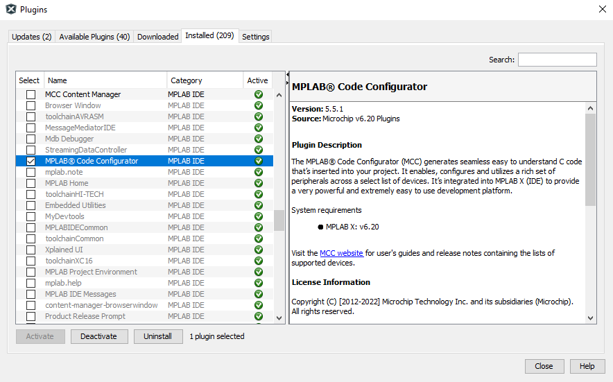
5.  On launching MCC click on Content Manager button.

    |WARNING|
    |-------|
    |Kindly use mentioned Driver Version's only as shown in  the below image|

    1.  Expand Libraries section and load the available version of rnbd-rn487x-host-driver BLE Library
        -   **Common for PIC & AVR**

             

            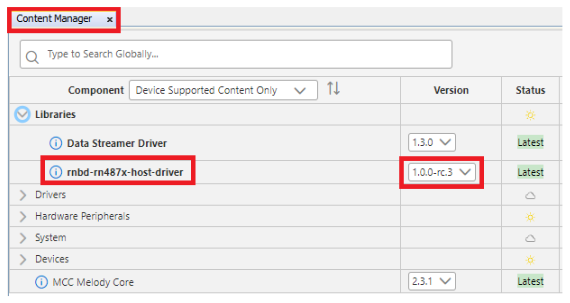

             

    2.  Expand Drivers section and load the below version of UART Drivers

         

        

         

         

        

         

         

        

         

    3.  Click on Apply Button to finish the Library and Driver Configurations:

         

        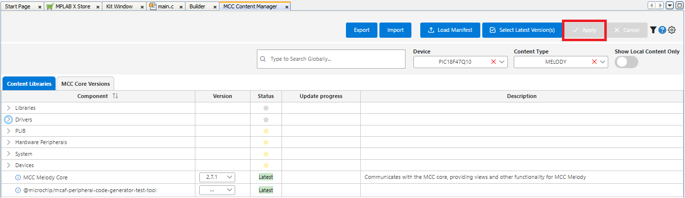

         

6.  From the In the Device Resources panel under Libraries dropdown select: rnbd-rn487x BLE Module.

     

    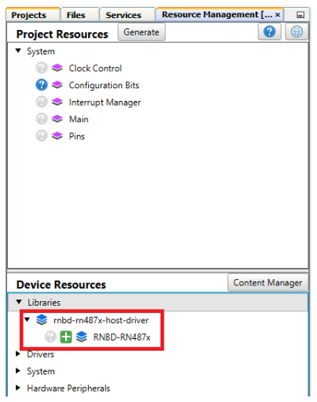

     

    Add the RNBD-RN487x from Device Resource to Project Resource as below

     

    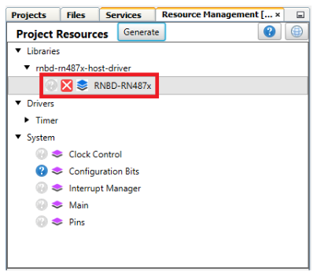

     

7.  The Notifications \[MCC\] tab will appear after library addition to describe required actions. These reflect the need for Reset Pin connected to the Module to be assigned to a pin this is required by the library. Select and configure dependent UART instance under Dependency Selector

    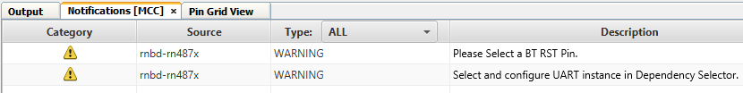

8.  Generating Example Applications:

    -   Enable Sample Examples toggle button ---\> Under Reference Example drop Down choose any of the example application as listed below,
        -   Basic Data Exchange
        -   Transparent UART Application

             

            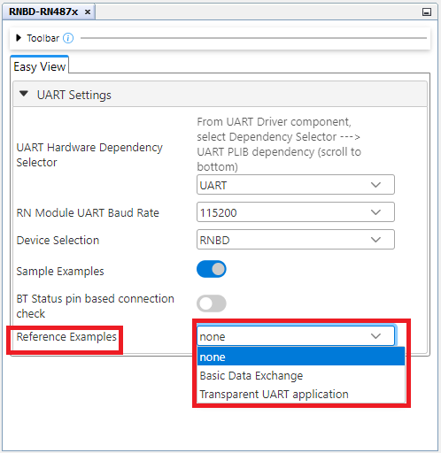

             

            **Note:**Any one of the Examples can only be  selected with is common for both RNBD/RN487x

9.  Clock Settings:
    -   From the Project Resource panel under System select Clock Control

         

        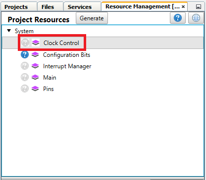

         

    -   Set HF Internal Clock to 32\_MHz and Clock Divider to 1 as shown  below

         

        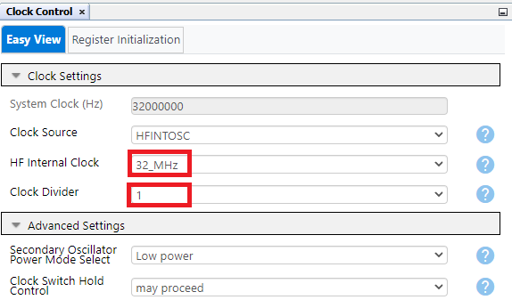

         

10. UART Settings:
    -   **PIC**
        -   **NOTE:** The below UART selections are applicable for both Transparent UART Application & Basic Data Exchange \(EUSART1 & EUSART2\)

            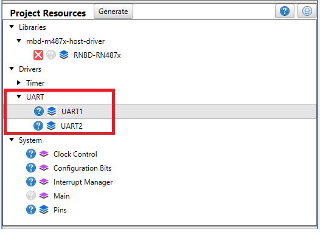

 

