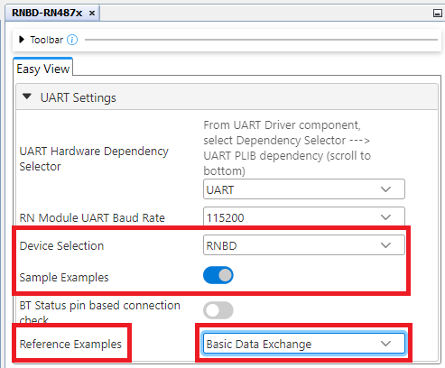
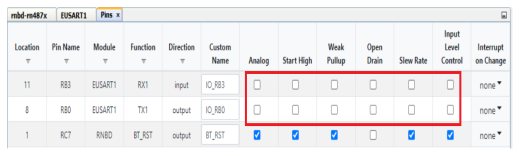
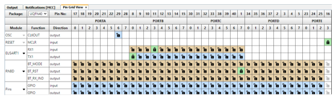

# RNBD Basic Data Exchange PIN Settings:

 

-   **PIC18F47Q10 MCC Configuration - Basic Data Exchange Example.**

     

    

     

 

**Note:**

-   Basic Data Exchange Application uses only one instance of EUSART1 for data transfer
-   **Important:** EUSART Rx1/Tx1 **Uncheck** Analog, Slew Rate & Input Level Control checkboxes as shown below.

    

     

    

Configuration for PIC Basic Data Exchange was completed click [here](GUID-75347D2C-2F59-4F80-851D-F786CDA0548F.md) for code  generation steps.

**Parent topic:**[RNBD451 Set Up & Running Example Application](GUID-67A04F29-B099-418B-A3E7-B4781BE8AF34.md)

